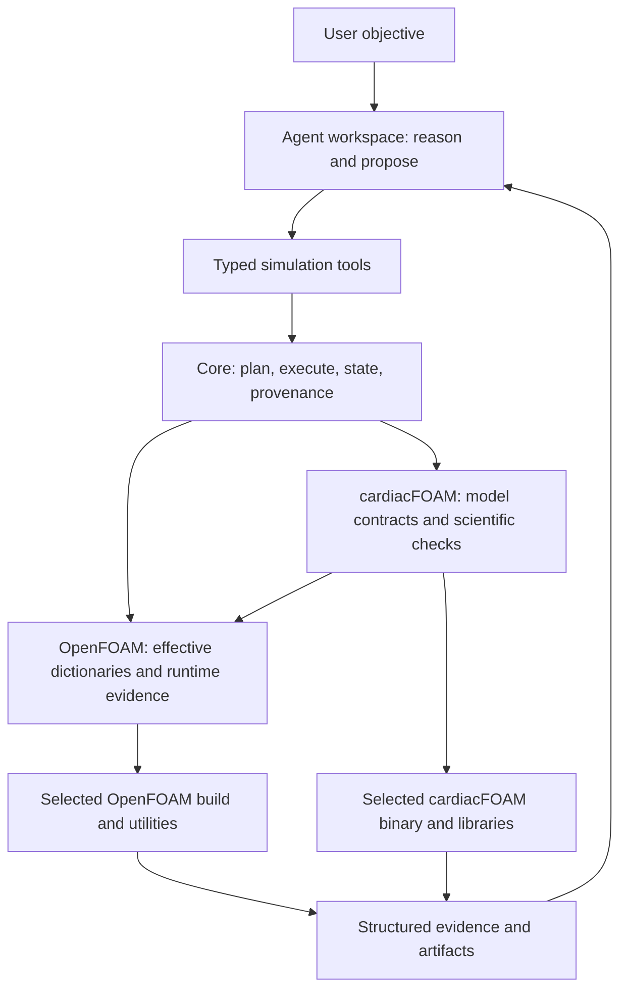

# omniD: roadmap for an agent-ready simulation framework

**Test-scope update, 2026-09-10:** [Cardiac reconciliation plan](CARDIACFOAM_RECONCILIATION_PLAN.md) records T1b, H1, T6, and T7 as complete. DriverFOAM owns orchestration and adapter-contract tests and reuses solver-owned scientific regressions; tutorial/paper content is not frozen by ordinary Core tests. The first installed experiment interface and adapter-owned staging/output convention extraction are complete. Continue incrementally with remaining OpenFOAM interpretation rather than reopening the architecture.

**Current implementation review:** [September 8 reassessment](roadmap-audit-2026-09-08.md) records completed lifecycle/repair work and the remaining core/OpenFOAM acceptance gates at `bea21d4`. The audit findings below describe the September 5 baseline.

**Proposed roadmap, 2026-09-05.** Audited against `d19ea1543f1c7be7ce10084f06a2434c0901a011`. This document starts from the requested product and challenges the existing implementation; it does not declare the implementation complete. Supporting evidence lives in [the audit baseline and comparison](roadmap-audit-2026-09-05/baseline-and-prior-art.md), [the core team report](roadmap-audit-2026-09-05/core-team.md), [the simulation team report](roadmap-audit-2026-09-05/simulation-team.md), [the cardiac expert report](roadmap-audit-2026-09-05/cardiac-expert.md), and [the verification/publication report](roadmap-audit-2026-09-05/release-team.md).

## 1. The product to build

An agent should be able to discover what a selected simulation environment and solver support, inspect why a setting exists, propose a case, receive explicit validation evidence, execute a fixed plan, and investigate results through structured tools. It should not have to infer ordinary configuration rules from terminal text or reconstruct defaults by browsing unrelated C++ files.

There are **two logical layers** with **three ownership boundaries**:

1. **Reasoning layer — omniD's agent workspace.** Holds the scientific objective, exploration history and proposed actions. The agent can reason, compare numerical choices and request evidence. Its choices need not be deterministic.
2. **Tool layer — enforced contracts.** The core owns generic planning and execution. The OpenFOAM package owns OpenFOAM file/runtime semantics. The cardiacFOAM package owns cardiac solver semantics and scientific constraints. The agent receives their answers through one coherent tool interface.

The existing `omnidriver` package is predominantly an orchestrator and CLI, not a complete resident-agent workspace. Decide and document that product boundary instead of implying that the package split already provides a brain. Start with a small agent adapter over a stable application API; retain compatibility with an external agent host. Add a resident agent service only if session persistence, scheduling or access control actually requires one.

This describes responsibility, not a requirement for additional packages or processes. Preserve the current three distributions initially.

## 2. Define what “deterministic” can promise

| Property | Intended guarantee | Boundary |
|---|---|---|
| Tool contract | Same normalized request, declared dependencies and policy produce the same semantic answer and plan identity. | Timestamps, attempt IDs and timings are observations outside semantic identity. |
| Configuration | A value is either resolved with source/runtime evidence or explicitly unresolved. | Lexical parsing does not evaluate all OpenFOAM semantics. |
| Execution | The executed commands, effective inputs and dependency identities match the reviewed plan. | Files, environment and binaries can change; dispatch must detect drift. |
| Reproducibility | Results can be traced and repeated under a declared build and execution profile. | MPI reductions, hardware and accelerator paths may require tolerance-based equivalence rather than bitwise equality. |
| Scientific validity | Defined benchmarks and case-specific acceptance criteria have recorded outcomes. | Passing schema/preflight and exit code zero cannot guarantee convergence, physiological plausibility or suitability for an unseen problem. |

Every preflight result must distinguish `pass`, `fail`, `unknown`, `unsupported`, and `not_applicable`, with applicability, evidence origin and reason codes. Separate structural, effective-configuration, solver-semantic, environment and scientific checks. Missing or skipped checks must never increase a readiness score or appear as proven compatibility. An explicit execution policy determines which states block dispatch.

The target statement is **“known incompatibilities are caught before execution; unresolved conditions are visible; the resulting attempt is attributable.”** It is not “we can know every case will run successfully.”

## 3. What the current code actually demonstrates

The existing suite passed: 1,568 passed, 274 skipped, 3 deselected and 40 passing subtests on Python 3.14.3. Both static boundary and generated capability-table checks passed. This is useful regression evidence. It does not cover the full installed runtime, live solver or end-to-end assurance contract. See the baseline for the exact command and limits.

| Claim to challenge | Audit finding | Decision |
|---|---|---|
| Provenance makes execution reproducible. | Fingerprint models exist, but production searches found no calls wiring input enumeration/snapshots into CLI resume. Existing state is loaded without checking it against the new plan. | Keep the models; make them enforce execution and resume identity. |
| Fallback dictionary support increases reliability. | Tiny fixtures reproduced a reader selecting a commented value and a writer modifying that comment while leaving the live value unchanged. Includes, substitutions and multiline entries need explicit semantics. | Remove silent equivalence between parser backends. Use capability-limited results and native effective-config evidence. |
| A frozen context fixes plugin semantics for a plan. | The capability identity hashes profile YAML; live plugin hooks can change their returned command capabilities without changing that identity. Full `run` also drops context before the step runner. | Bind resolved contracts and implementations to a plan; pass context consistently. |
| An artifact match establishes successful work. | Existing glob matches can satisfy output checks without establishing that this attempt produced valid, complete output. | Require attempt attribution and declared completion checks. |
| Catalog coverage establishes solver compatibility. | Source scanning is explicitly heuristic; lexical reads do not capture defaults, conditions, build choices or effective runtime selection. | Separate candidate discovery, reviewed semantic contracts and compiled runtime evidence. |
| A build manifest proves the selected solver's identity. | A manifest without any artifact list passes its validator; manifest selection and dispatch executable selection are not bound together. Current runtime/source observations also do not prove historical build provenance. | Require a complete manifest, verify the actual dispatch binary and libraries, and separate build attestation from runtime inspection. |
| Compatibility tables correctly describe coupled systems. | Validation compares every coupler to the first network's solver; uncovered pairs yield no diagnostic. Some ionic compatibility metadata has no production consumer. | Resolve each named coupling edge and expose rule coverage; distinguish missing rules from accepted combinations. |
| Recommended values have consistent scientific meaning. | A dimensionless model recommendation occupies fields documented as dimensional PDE stimulus; examples can also become written defaults. | Separate units, internal model quantities, solver inputs, examples, defaults and validated recommendations. |
| Import separation establishes environment independence. | Generic OpenFOAM mesh checks infer units from cardiac-sized geometry thresholds; compatibility fallbacks still encode OpenFOAM assumptions. | Move domain policy to cardiacFOAM; test another minimal environment contract behaviorally. |
| Green tests establish release readiness. | Many native/tutorial checks skip, adapter packages lack the core's equivalent wheel gates, and release is not tied to full exact-revision validation. | Introduce required runtime and all-package artifact gates for the declared support profile. |

These are not arguments for discarding the repository. `DriverContext`, structured plans/DAGs, run documents, capability discovery, provenance models, catalog export and package-boundary checks are useful foundations. The main deficit is that their guarantees are not consistently enforced where operations meet.

## 4. Contracts and authority

### Core ownership

Use one canonical flow: `request → inspect → resolve → validate → plan → stage → dispatch → observe → reconcile`. Both CLI and agent tools call the same application functions. `step`, `run`, resume and sweep must share those semantics.

Define a versioned **ResolvedPlan** containing normalized operations, consumed and produced artifacts, effective configuration digest, contract/catalog identity, plugin implementation/build identity, execution environment identity, validation evidence and policy. Separate experiment identity from plan identity and execution-attempt identity. A saved state is reusable only when its plan and consumed dependencies match; downstream invalidation follows the DAG.

Stage edits in an isolated case, validate them, expose the diff and new plan, then commit the case transaction. A failed edit batch must leave the original case unchanged. Define the supported filesystem commit mechanism: atomic case-directory replacement where available, or a journaled commit with recovery and dispatch blocked until completion. Do not promise atomic multi-file writes across arbitrary filesystems. Launch only against the committed plan identity. Recheck result-affecting dependencies at dispatch and define how mid-run changes are prevented or detected.

Enforce process lifecycle, cancellation, timeout cleanup, attempt budgets, retry eligibility, state locking and crash recovery. Retry is a step-specific contract: timeouts alone do not establish that a retry is safe. Existing outputs cannot prove a new attempt succeeded.

### OpenFOAM ownership

Expose three distinct operations: **lexical inspection**, **effective dictionary resolution**, and **transactional mutation**. Return the parser/evaluator identity, supported syntax, errors and unresolved entries. Pin the supported foamlib/OpenFOAM combinations. A fallback can inspect a documented subset; it cannot silently authorize a write or certify full resolution.

Conformance fixtures must cover nested dictionaries, block/line comments, duplicate and regex keys, multiline entries, dimensions, lists, includes and include precedence, variable substitution, generated entries, instance/time selection, and supported binary field forms. Use the supported OpenFOAM runtime as the oracle where evaluation is required. Track all files and environment variables that influence resolution. Handle executable dictionary evaluation as an explicit operation in the execution contract; it is not a read-only parsing side effect.

Own mesh/field file semantics, dimensional metadata, `fvSchemes`, `fvSolution`, `controlDict`, decomposition and utilities. Query installed runtime selections and effective defaults through version-specific utilities or a small native probe. Report family/version, scalar and label precision, compiler/build options, binary/library digests and relevant MPI configuration. Do not infer physical units from object size in the generic adapter.

### cardiacFOAM ownership

Represent solver modes, equations, ionic/active-tension/mechanics models, required fields/files, stimuli, tissue scopes, coupling, boundary conditions and output semantics as versioned contracts. For each supported parameter record:

- Qualified dictionary path and model/tissue scope; type and dimensions/units.
- Requiredness and activation conditions; supported build/runtime selections.
- Compiled default or default expression, with evidence and applicable build.
- Tutorial/example value separately from a numerical recommendation or scientific admissibility constraint.
- Cross-parameter requirements, incompatibilities and remediation codes.
- Source symbol, source revision/content identity, extractor/reviewer identity and runtime verification status.

Build source-to-contract extraction as a narrow engineering tool, not a general C++ comprehension system. Use the actual compilation configuration for AST-assisted discovery; preserve unresolved expressions, virtual dispatch, preprocessing and conditional reads explicitly. Prefer solver-native machine-readable introspection for compiled model/parameter availability and defaults. Extend existing introspection utilities where practical. Review semantic rules and scientific ranges; do not manufacture them from names or comments.

Compatibility is a predicate over **case × model selections × build × environment**, with evidence. An unlisted model is `unknown` or `unsupported`, not automatically incompatible; a listed model is not automatically available in every binary. Catalog/source/build drift must invalidate verified status.

### Freedom for numerical exploration

The agent may query and compare supported numerical schemes, tolerances, time stepping and discretization choices. It can propose uncatalogued settings through an explicitly marked exploratory path. That path still requires a parseable staged diff, declared uncertainty, applicable runtime validation and a new plan identity. Suggestions, defaults and hard constraints must remain separate. The agent must not silently repair a scientific choice, change units or change a model to make a case pass.

## 5. Team structure and handoffs

| Team | Lead responsibility | Expert responsibilities | Deliverables and handoff |
|---|---|---|---|
| Core and agent contract | Own application API, lifecycle and minimal abstraction boundaries. | Independent contract expert; implementation roles for workflow state/provenance and agent tool/evaluation design. | ResolvedPlan and attempt contracts; deterministic fixtures; consume environment/domain evidence without reinterpreting it. |
| Simulation semantics | Own OpenFOAM foundation and cardiacFOAM integration. | Independent cardiac solver expert; implementation roles for dictionary/native I/O, C++ extraction, and scientific validation. | Effective-config contract, supported runtime profile and source/build-bound solver catalog; feed core standardized evidence. |
| Verification and publication | Own acceptance criteria, packaged installation and user-facing release claims. | Independent packaging/test expert; implementation roles for runtime CI, reproducibility and onboarding. | Release evidence manifest and clean-install agent walkthrough; validate the other teams' integrated result. |
| Program integration (Astra) | Resolve conflicting abstractions and keep scope tied to the user's goal. | Review team evidence and compare established workflow practices. | This roadmap, dependency order, decision log and release acceptance. |

Implementation roles describe needed expertise, not an assertion that every role is staffed concurrently. For this audit, leads and independent experts work in bounded groups within four concurrent agent slots. Each implementation work item should have one owner and an acceptance reviewer from a different team. A team may propose deleting an abstraction; it must first show the behavior and migration path that replaces it.

## 6. Delivery roadmap

Priority means dependency and release impact: **P0** blocks a trustworthy first supported workflow; **P1** blocks a supported public release; **P2** expands the framework after those guarantees work. Effort is deliberately not estimated in calendar dates before the supported solver build and first vertical slice are fixed.

| Phase / work IDs | Priority / owner | Deliverable | Acceptance gate / dependencies |
|---|---|---|---|
| **0. Scope and baseline** — D01 support profile, D02 claim ledger, D03 architecture decisions, R00 harness repair | P0 / program + verification | Name the first OpenFOAM distribution/version, cardiac build/backend, OS/precision and CPU/MPI scope. Define assurance states, representative cases and a seam/consumer inventory. Repair namespace-dependent regression invocation and isolate pure tests from native fixture skips. | Reproducible fixture bundle and version manifest; unknown support explicitly listed; verification path runs against the actual namespace packages. Existing docs do not override measured behavior. |
| **1. Close false-success paths** — C01 state/plan identity, C02 context propagation, C03 output attribution, F01 fallback correctness, F02 environment exit status, S00 manifest/network repairs | P0 / core + simulation | Refuse stale state, retain selected context, distinguish old artifacts, prevent comment/multiline mutation errors, preserve setup failures, require manifest artifacts and resolve named network edges. | Fixtures fail on current bugs and pass after fixes; run/step/sweep parity; failed sourcing and incomplete manifests block the corresponding readiness claim; coupling checks are independent of network order. Depends on D01–D03. |
| **2. Resolve and edit real configuration** — F03 parser capability contract, F04 native resolution, C04 transactional mutation, C05 immutable plan | P0 / simulation + core | One effective configuration with dependency closure; staged edit diff and validated plan; versioned parser evidence. | Differential fixtures agree with selected OpenFOAM or report unsupported/unknown; failed batch leaves case unchanged; an edit after plan invalidates launch. Depends on phase 1. |
| **3. Bind solver knowledge to reality** — S01 parameter contract, S02 source/runtime export, S03 compatibility predicates, S04 tutorial coverage | P0 for first slice; P1 for wider scope / simulation | Reviewed first-mode catalog with units, conditions, defaults and runtime selection evidence. Tutorials become versioned executable examples of those contracts. | Selected compiled utility/probe agrees with catalog; changed build/source invalidates verification; invalid combinations produce stable diagnostics; no asserted support has a skipped required check. Depends on phase 2 contracts. |
| **4. Enforce complete attempts** — C06 provenance integration, C07 process/retry/cancel contract, C08 recovery/locking, C09 adapter simplification, S05 diagnostic/artifact policy | P0 / core + verification | Same identity checked at plan/dispatch/resume; content evidence for required inputs; process-tree cleanup; crash recovery; shared lifecycle and minimal adapter contract; attempt-scoped outputs and stable failure codes. | Changed include/binary/library/large input causes invalidation; timeout leaves no live descendants; zero attempt budget dispatches nothing; concurrent operations cannot corrupt a case; stale/partial outputs cannot mark completion; neutral toy plugin passes the same lifecycle suite. Depends on phases 1–3 interfaces. |
| **5. Make it usable by an agent** — A01 typed tools, A02 end-to-end evaluations, A03 explanations and exploration | P0 / core + simulation + verification | Agent adapter over shared API, concise discover/inspect/plan/execute/observe tools and evidence-linked explanations. | A fresh agent completes the first case using tool results; detects invalid model, missing parameter, wrong dimension, unresolved config, missing runtime and stale resume without ad hoc terminal inference. Unknown runtime failure remains unknown. Depends on phases 2–4. |
| **6. Release the supported slice** — R01 all-package wheels/sdists, R02 native CI, R03 scientific benchmarks, R04 onboarding/versioning/licensing decisions | P1 / verification + owner | Clean supported installation, exact-artifact release gates, profile-specific native tests, documented limits, complete example inputs and reproducibility bundle. | From a clean environment, install all three artifacts, materialize each advertised acceptance case, describe→plan→run→resume, validate outputs and rerun comparison; invalid case refuses before launch. Required tests cannot silently skip; tests encode the supported profile rather than one maintainer machine. Depends on phases 3–5. |
| **7. Broaden only after proof** — X01 second real solver/environment, X02 additional cardiac modes, X03 HPC/backend evaluation | P2 / program + relevant team | Broader support justified by measured use cases. | A second real engine passes the generic conformance suite established with the toy plugin; additional supported physical modes pass their own scientific gates. Compare existing execution backends before building scheduler infrastructure. Depends on phase 6. |

Phases are gates, not strictly serialized staffing. Once phase 0 names shared contracts, catalog discovery, runtime fixture preparation and wheel/onboarding work can proceed in parallel. The critical path is dictionary correctness → effective configuration and plan identity → source/build-bound semantic validation → attributable execution → agent evaluation → release evidence.

### First implementation batch

Keep the first batch narrow enough to review: add adversarial fixtures for the observed comment read/write bug, failed bashrc sourcing, stale completed state, full-run context loss and preexisting output acceptance; fix those paths without redesigning scientific models. In a separate solver-contract batch, require complete manifest evidence and correct named-network scoping. Repair the native regression helper's namespace-package failure before relying on it for live validation. Publish the resulting behavior and remaining limitations before widening catalog scope. Then implement transactional configuration and identity as a single integrated vertical slice.

This is not permission to change the scientific model. Scientific defaults, units and numerical recommendations require the source/runtime and domain-review evidence specified above. Owner decisions on intended first physics mode, supported build and distribution license are explicit work items, not assumptions hidden in code.

### Finding-to-work traceability

Audit IDs belong to their team reports; work IDs belong to the phase table above.

| Audit findings | Work IDs / acceptance responsibility |
|---|---|
| Core C1 stale resume; C3 incomplete semantic identity; C4 weak large-file identity | C01, C05, C06 — core implementation, verification review |
| Core C2 lost context; C8 excess/implicit adapter contracts | C02, C09 — core implementation, simulation and neutral-plugin review |
| Core C5 stale artifacts; C6 ownership/retry; C10 attempt ceiling | C03, C07, C08, S05 — core implementation, adversarial lifecycle review |
| Core C7 readiness certainty; C11 heuristic diagnostics | D03, S05, A01, A02 — shared evidence schema and unknown-result evaluation |
| Core C9 partial edits; OpenFOAM OF-01/02 read/write semantics; OF-05 hidden parse failures | F01, F03, F04, C04 — native dictionary conformance and transaction gates |
| OpenFOAM OF-03 masked source failure; OF-08 incomplete environment identity | F02, S00, S02, C06 — runtime profile and launch identity checks |
| OpenFOAM OF-04 scanner evidence; OF-07 example/default conflation; cardiac CF-04 units | S01, S02, S04 — generated facts separated from curated scientific guidance |
| OpenFOAM OF-06 inferred geometry units; OF-09 missing differential checks | F03, F04, C09, R02 — explicit unit contract and maintained native oracle corpus |
| Cardiac CF-01/02 incomplete manifest and inferred build history | S00, S02, C05, C06 — complete build evidence bound to actual executable/libraries |
| Cardiac CF-03 network scoping and uncovered compatibility | S00, S03 — named-edge/order-invariance and unknown-pair tests |
| Cardiac CF-05 catalog/runtime/tutorial drift | S02, S04, R02, R03 — bidirectional inventory and per-profile tutorial evidence |
| Release R1 exact artifacts; R2 machine-specific native tests | R01, R02 — clean artifacts and portable applicability-aware verification |
| Release R3 broad skips and broken native harness | R00, R02 — real invocation coverage and required-check manifest |
| Release R4 incomplete tutorial demonstration; R5 onboarding/agent evaluations | S04, A01–A03, R03, R04 — complete shipped cases and fresh-agent acceptance |

## 7. Keep, simplify, replace, defer

| Treatment | Components / behavior | Reason and migration rule |
|---|---|---|
| Keep | Three-package split, entry points, explicit context, typed DAG/run documents, catalog discovery/export, provenance data models, static boundary checks. | Useful seams with existing tests. Enforce them in composed execution before creating alternatives. |
| Simplify | Public protocol → capability adapter → compatibility fallback chains; duplicate plan/run/step/sweep orchestration; overlapping catalog representations. | Map each seam to a real consumer. Introduce one shared lifecycle and one versioned semantic contract, then remove redundant forwarding layers once callers migrate. |
| Replace | Silent parser fallback success, geometry-derived unit truth, directory-name-based trust, unbound resume, glob-only completion and profile-only semantic identity. | They can claim certainty without sufficient evidence. Replace behavior behind focused acceptance tests. |
| Relocate | Cardiac applicability assumptions and scientific ranges currently in environment/generic paths; repository-only source discovery. | Domain owns physics. Development tooling receives explicit source roots and does not define installed runtime truth. |
| Retain with explicit limits | Regex C++ discovery and legacy-log parsing. | Candidate evidence and diagnostic fallback are useful if unresolved coverage is visible. Neither can authorize an unsupported scientific claim. |
| Defer | New engine, general C++ knowledge graph/vector store, resident multi-agent service, broad scheduler platform, wholesale rewrite. | No demonstrated requirement yet outweighs the integration work and extra maintenance. |

Abstraction removal must be behavior-led: demonstrate one shared replacement path, migrate consumers, run component and integrated checks, and delete the obsolete path. Do not preserve a fallback indefinitely just because earlier migration notes call it mandatory; do not delete a dependency simply because Python import scans miss a binary consumer.

## 8. Evidence required to call the first release ready

- **Installable:** all distributions and bundled schema/templates/tutorial fixtures work from built artifacts without a checkout; compatible dependencies are available through the documented installation route.
- **Discoverable:** a new agent can query supported model/configuration/runtime contracts without importing internal Python modules or reading the repository's migration history.
- **Honest:** missing, skipped or unresolved evidence is visible; successful preflight makes no unconditional scientific claim.
- **Bound:** the exact plan, effective configuration and binary/library identities are enforced at dispatch and resume; changed large inputs cannot masquerade as verified unchanged.
- **Transactional:** failed edits leave no partial case; concurrent attempts have isolated state and outputs.
- **Attributable:** output completion requires evidence from this attempt, with required end-time/rank/field constraints where applicable.
- **Diagnosable:** supported failures have stable codes and evidence; unknown failures preserve raw logs and remain explicitly unknown.
- **Scientifically checked:** the supported cardiac mode passes defined unit, conservation/physical, temporal/spatial convergence and reference-result checks as appropriate; tolerances and applicability are recorded by the domain team.
- **Agent evaluated:** end-to-end scenarios measure false acceptance, unsupported-claim rate, unexplained shell fallback, task completion and reproducibility. Release corpus must contain zero known false-positive compatibility or stale-resume acceptances; publish corpus size and limits rather than universal reliability claims.
- **Publishable:** supported-platform matrix, API/schema migrations, known limitations, owner-approved distribution terms and runnable examples ship with release artifacts. This audit does not settle licensing or certify scientific use.

The initial release recommendation is narrow cardiacFOAM support on an explicitly pinned runtime: a short single-cell protocol for inexpensive parameter/default verification and a minimal monodomain tissue case to exercise the actual finite-volume configuration, mesh, fields and numerical choices. These are proposed acceptance slices, not newly declared support or selected scientific defaults. Keep a minimal noncardiac contract fixture to protect core boundaries. Broader bidomain, multiple networks, electromechanics and accelerator support each require their own evidence gates; none is implied by passing the first slice.
