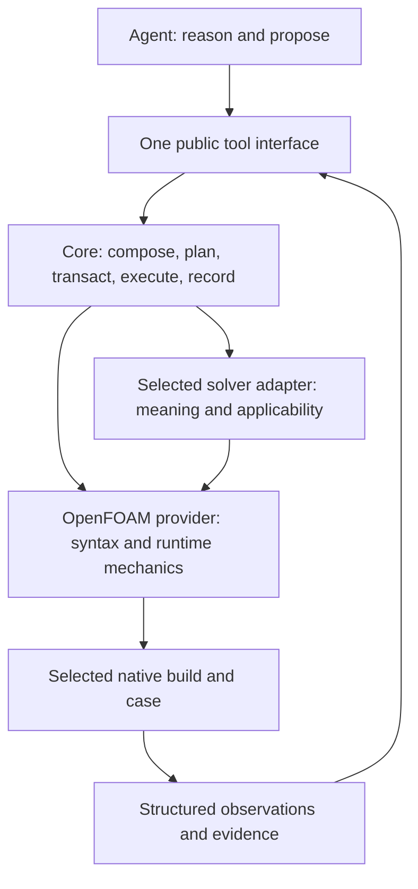

# OmniDriver: architecture decision and implementation roadmap

**2026-09-22 — decision: retain the package boundaries; revise Phase 2 before implementation.**

Audit baseline: `db93cc436883a09346658e6113870c6c9f421a6d`. Maintainer scope: architecture, current implementation, and an actionable plan; no expansion of scientific support and no production implementation in this audit. Pre-existing changes to cardiacCore `workflows/run_config.py` and `tests/test_validate_configuration.py` were preserved. The latter exposes a currently unwired validation hook.

The product idea is coherent. The existing code is neither a clean completion nor a reason for a wholesale rewrite. Its package separation, explicit contexts, provider composition, workflow execution, provenance, and tests are valuable. Several guarantees are lost between those pieces. A write-channel refactor can help, but it cannot by itself normalize solver meaning, repair effective-configuration evidence, or establish release readiness.

The existing [Phase 2 plan](../superpowers/plans/2026-09-20-phase2-one-write-channel.md) should not be executed verbatim. Complete the prerequisite fixes below and replace its contract/examples before beginning migration. Historical plans are evidence of intent, not proof of present behavior.

## 1. The intended architecture

There are **two logical layers**, with **three tool ownership boundaries**:

| Responsibility | Owner | What an agent should receive |
|---|---|---|
| Objectives, hypotheses, choosing supported numerical alternatives, interpreting evidence, deciding the next experiment | Agent workspace, initially hosted by the existing agent provider | A persistent reasoning/task record and explicit proposals through the tool API |
| Provider resolution, request/plan identities, scheduling, case transactions, execution state, provenance, budgets and recovery | `omnidriver` core | The same request/result contracts for every adapter |
| OpenFOAM dictionary syntax and effective evaluation, format-specific rendering, environment and build inspection, finite-volume runtime mechanisms, native utilities | `omnidriver-openfoam` | Version-bound mechanical facts, complete dependency evidence where supported, and explicit unresolved results elsewhere |
| Model equations/variables, physical meaning, units, applicability, scientific compatibility, domain workflow definitions and acceptance criteria | The selected solver adapter, such as cardiacFoam or cardiacCore | Evidence-backed semantic contracts and workflow support for that package |

The `S → F` edge is legitimate use of a lower-level library/service. It does not mean a solver embeds a second provider stack or reimplements the OpenFOAM parser. Core must remain usable with a provider that has no OpenFOAM files. Provider composition chooses capabilities; format rendering remains with the format owner.

The repository currently supplies a tool/orchestration framework, not a complete resident reasoning agent. Start by exposing the existing application functions to an external agent host. A new resident service, broad C++ knowledge graph, or general plugin platform is not a prerequisite for this release.

## 2. What “normalized” must mean

**Normalize the interface and evidence, not the scientific contents.** cardiacCore preprocessing and cardiacFoam electrophysiology need not advertise the same workflow, parameters, or synthesis ability. Every adapter must answer the same questions about what it does support.

Use a common parameter envelope with a stable qualified ID, owner, native document and structured key path, dynamic path bindings, value shape, requiredness/applicability, evidence references, and read/write/support status. Physical units and ranges are supplied only where justified by domain evidence. A vector, tensor, dimensioned quantity, enum, dictionary, and list cannot safely be squeezed into an unqualified scalar/string vocabulary. Reuse and extend existing dictionary/catalog types before inventing another registry.

Keep these value sources distinct:

- Explicit case value, including its original file and key.
- Effective native value after supported evaluation, including dependency and runtime identity.
- C++ call-site default for a specific path/build; this may not appear in any dictionary.
- Tutorial example or framework-authored template value.
- Domain recommendation, with applicability and supporting evidence.

None automatically becomes another. In particular, the agent may explore supported OpenFOAM numerical choices, but a tutorial tolerance is not a universal solver default and a plausible value is not a validated scientific recommendation. The [OpenFOAM dictionary API](https://cpp.openfoam.org/v13/classFoam_1_1dictionary.html) exposes caller-supplied defaults; the [foamlib API](https://foamlib.readthedocs.io/en/stable/files.html) is a parser/editor. These are different evidence sources, and neither reference pins the user's solver build.

Before execution, report separate structural, effective-configuration, solver-semantic, environment, and scientific checks. Standardize statuses and stable reason codes through the existing diagnostic types, with requiredness/applicability declared. Missing required evidence blocks the relevant action; offline inspection can still return useful unresolved results. A successful preflight means known applicable checks passed. It cannot guarantee convergence or scientific validity of an arbitrary simulation.

C++ discovery should remain bounded: source locations and candidate dictionary reads, build-bound native inventory where available, and reviewed contracts for conditional behavior. Regex discovery does not infer arbitrary program semantics. Runtime failure classification can map known patterns to structured evidence; unfamiliar failures remain unknown with raw logs preserved.

## 3. Findings that change the implementation order

These are current code findings unless explicitly marked as proposal defects. The IDs below belong to this consolidated roadmap; each team report uses its own finding IDs and contains source symbols and reproduction details.

| Priority / ID | Evidence-backed finding | Implementation consequence |
|---|---|---|
| P0 / C1 | `provider_stack.order_providers` builds dependency sets; a multi-dependency fixture changes provider order across `PYTHONHASHSEED` values. Duplicate IDs are also silently overwritten. | Stabilize topological ordering and reject duplicate identities before relying on stack order/digest for writer ownership. |
| P0 / F1 | `_OverrideScopeAdapter.apply` accepts but does not forward `execution_env`; the OpenFOAM hook also omits it. The real composed override path can return no effective-value evidence after writing. | Repair and test the full public path. Required readback must not be satisfied by an empty evidence tuple. |
| P0 / F1b | Native readback compares text: a requested `1e-3` resolves to `0.001` and is reported as a mismatch. | Fix typed comparison in the same batch as environment forwarding, or the newly enabled check will reject valid edits. Preserve raw spelling; do not use a loose numerical tolerance to hide configuration differences. |
| P0 / F2 | A native OpenFOAM v2412 probe resolves a site `#includeEtc` value while the inspector records the vendor file. | Dependency closure must match the native-selected files or be unresolved. Test site/user/version search against the selected runtime. |
| P0 / S1 | cardiacCore accepts an undeclared dynamic ventricle segment, a non-vector string for a vector entry, and non-finite scalar values. `slot_key` drops document scope and has real collisions. | Fix parameter addressing and syntax/finite-value validation before centralizing writes. Do not invent new physiological ranges. |
| P0 / S2 | cardiacCore's `validate_configuration` hook is a stub; catalog, workflow-active fields, and editable fields are not consistently aligned. The pre-existing WIP test fails on a half-specified bidomain pair. | Wire workflow-relevant validation deliberately, reconcile support claims, and review the user's partial fix before modifying it. |
| P0 / S3 | Slab configuration can replace a requested conductivity field name with `None` through a scar-key collision; its DAG still names default `0/fiber` and `0/sheet` inputs after field-name overrides. | Resolve final workflow inputs once from effective configuration and use them for staging, validation, DAG edges, and provenance. Reproduce the public execution consequence before changing core. |
| P1 / C2 | `is_launchable` models unavailable checks, but dispatch does not carry their audit evidence. | Enforce required-check coverage at the execution boundary instead of relying on an introspection field. |
| P1 / C3 | Provider resolution metadata can name a provider that returned `None`, rather than the provider that supplied the actual answer; declared `provides` is not an export filter. | Decide and document capability exposure, record actual resolution provenance, and test ambiguity/precedence. Avoid assuming declaration metadata is runtime truth. |
| P1 / C4 | `build_stack_identity` explicitly records placeholder digests for most capabilities, leaving some editable implementation/content changes invisible. Explicit plugin selection also expands only one dependency level. | Bind the reviewed plan to the contracts and implementations actually used; share explicit/default dependency closure before extending to deeper stacks. Neither issue requires a new plugin framework. |
| P1 / F3 | The OpenFOAM provider does not offer the reusable numerical parameter/default knowledge surface the product needs. Existing builders author numerical choices. | Inventory and label authored templates versus native defaults; add a bounded read/inspect contract tied to a build. |
| P1 / F4 | `populate_values(..., typical_value_fallback=True)` promotes catalog examples into generated inputs; the C++ scanner can miss reads after `//` inside a string and duplicate nested read matches. | Record value origins and default policy explicitly; repair the bounded scanner against a corpus. Do not infer catalog completeness or scientific authority from discovery output. |
| P1 / R1 | All-package wheel discovery exists, but release tags omit cardiacCore and release eligibility is not bound to all acceptance gates at the exact revision. | Extend the release workflow after contract convergence; preserve current artifact tests. |
| Proposal defect / W1 | Phase 2 JSON omits operation values; frozen records contain mutable payloads; patch dispatch has no complete corresponding capability signature. | Replace the proposed types and contract before writing production code. |
| Proposal defect / W2 | Phase 2 equates cloning/patching and fresh case synthesis, and describes per-file replacement as an atomic case write. | Share transaction/lifecycle machinery while retaining explicit creation modes and honest crash/visibility guarantees. |

Priority P0 here means prerequisite to trusting the refactor's determinism or edit correctness, not a claim of a security incident.

Two limits matter: C1 is reproduced with a multi-dependency provider fixture, not a changed scientific result in the shipped two-provider stacks. S3 proves accepted dictionary edits disagree with declared DAG inputs; it does not yet prove omission from resume fingerprints, because another provenance path walks case inputs. Validate that downstream consequence before changing core. S1 binding acceptance violates the adapter's declared `lv`/`rv` contract; independent review did not run the native cardiac reader. Finiteness regression cases include both scalar values and vector components, under an explicitly stated parameter-value policy.

## 4. Corrected Phase 2: one transaction channel, format-owned rendering

Keep the goal of one auditable channel for **framework-authored input mutations**. Native solvers and meshing utilities necessarily produce their own files; their outputs belong to declared workflow execution and artifact attribution. A grep count of all `write_text` calls cannot establish this boundary.

The proposed lifecycle is:

1. Normalize an explicit request for `clone-and-patch`, `synthesize`, or a supported generated-input operation. Include the selected adapter/workflow and explicit source artifacts. Refuse unsupported creation modes.
2. Ask the semantic owner to resolve parameters, applicability, concrete file addresses, and expected effects. Use qualified IDs and validated dynamic bindings, not ambiguous dotted strings.
3. Render candidate file contents through their format owner against an isolated snapshot. OpenFOAM handles OpenFOAM syntax; the solver provides its meaning/templates. Pure proposal building and effectful inspection/rendering must be named honestly and declare their dependencies.
4. Produce an immutable, versioned reviewed plan: full proposed values or content-addressed blobs, target paths, file modes where needed, before/after digests, source/build/contract identities, actual responsible providers, conflict checks, and validation evidence. Preconditions cover the complete read dependency set, including includes, source assets, relevant environment values, and absence where later file creation changes lookup. Journal before-images are execution state, not mutable fields inside the reviewed plan.
5. Recheck inputs and case ownership under a lease, persist a recoverable journal, and commit rendered bytes through a single core executor. Reject stale plans and overlapping conflicting edits. Respect path confinement and a declared symlink policy. Define one authoritative transaction head, legal states, and recovery owner, including materialization before execution attempts exist.
6. Perform the required post-write/effective checks under the same selected environment. Record the committed result separately from the plan, with transaction identity and resulting content digests. Specify idempotency and replay behavior: retrying after an uncertain response must recover the existing transaction or refuse drift, not blindly reapply. On failure restore overwritten files and remove newly created files; define directory cleanup and mode preservation explicitly. Interrupted journals prevent dispatch until recovery.
7. Dispatch only the committed/revalidated plan and attribute subsequent outputs to that attempt. Maintain ownership through the check-to-launch interval. Framework leases do not control arbitrary outside writers; state that concurrency limit explicitly.

This is a behavioral contract, not a request to add seven new abstraction layers. Reuse the current transaction journal, attempt lease, strict diagnostics, provider identities, and provenance models where they satisfy the contract. Extract common byte-writing mechanics only when the two real consumers need them.

Per-file atomic replacement plus a journal can provide recovery and block framework readers from an incomplete transaction. It is not simultaneous atomic visibility of multiple files to arbitrary outside processes. Document the supported filesystem/reader model and test interruption recovery. Large mesh/VTU assets need digest references and staged artifacts, not giant JSON payloads.

Before migration, the conformance suite must cover complete plan serialization and identity; no hidden mutable payloads; format-specific patching; repeated edits to one file; missing/new files; modes; rollback after injected failure; interrupted recovery and rollback failure; stale input/build; changed indirect dependency; replay after an uncertain result; competing attempts; path escape/symlinks; duplicate ownership; and post-write evidence unavailable. Replace illustrative tests that expect arbitrary text such as `"bad"` to fail without a declared type constraint. Define canonical serialization/digest rules and schema migration explicitly; the current stack digest alone does not bind all implementation or capability content.

Migrate one existing entry-case edit and one cardiacFoam synthesis path first. Demonstrate the same core transaction contract while preserving their different prerequisites. Then migrate sweeps, remediation, and adapter-generated inputs. Retire old hooks only after tracing and migrating their actual consumers; retain bounded compatibility where a public caller needs a transition.

### Disposition of the existing Phase 2 tasks

| Existing task | Decision |
|---|---|
| 1 — plan types | Rewrite: complete immutable payload, concrete addresses, preconditions, schema/identity, semantic owner and renderer. Keep execution journal data separate. |
| 2 — transactional writer | Keep the goal; replace the recipe with a case-level lease/journal/recovery contract. Existing remediation additionally requires attempt ownership: extract shared mechanics instead of inventing a fake attempt during initial materialization. |
| 3 — writer capability | Specify planning and rendering before implementing the executor. Explicitly support patch rendering; define ownership for multiple formats/providers rather than assuming one exclusive writer can answer everything. |
| 4 — value kinds | Retain generic value shapes in core; keep OpenFOAM text parsing in OpenFOAM and scientific constraints in the adapter. Fix current weak validation before promoting it. |
| 5 — dynamic paths | Retain the idea, but validate allowed bindings as well as expanding placeholders; preserve full document/scope identity. |
| 6 — cardiacCore migration | Pilot one workflow after addressing/validation fixes; require source assets and final effective configuration explicitly. |
| 7 — Python operation writers | Revise: atomic rename alone is not the promised planned transaction. Operations that author case inputs must join that channel; standalone output exports need their own clearly stated artifact contract. |
| 8 — split `build_and_launch` | Keep, after the contract is executable. Characterize complete output content/modes and declared workflow effects, not merely five files' existence. Preserve public compatibility for a declared interval. |
| 9 — retire duplicate materialization | Defer deletion until migrated public routes prove semantic parity. Supporting patch-based sweeps does not imply asset-free cardiacCore synthesis. |
| 10 — sweep schema | Useful independent API work. Derive from executable behavior, version it, and bundle it inside installed package resources; a repository-only `schemas/` file is insufficient. |
| 11 — introspection | Keep; expose qualified mutable/consumed/supported scopes, evidence, and complete proposed changes. Generate from the same contracts used by validation. |
| 12 — in-process operation type | Separate from transaction critical path. Reuse a generic type only when consumers need common validation/execution; preserve domain algorithms and maturity metadata in the adapter. |
| 13 — verification and close-out | Keep four installation shapes, add native and public-route conformance, and replace raw write-count acceptance with a reviewed mutation-path inventory. Do not stage pre-existing work using blanket `git add -A`. |

The rewrite must also resolve the internal API disagreement between `plan(request)` and examples calling `plan(case_root=..., values=...)`, and replace tests that assert only symbol existence or expect a type failure without a declared type contract. These are illustrative proposal defects, not reasons to weaken existing implementation tests.

## 5. Teams, expert ownership, and execution gates

Three team leaders performed this audit in parallel, followed by three independent expert reviewers. Implementation work should retain those ownership boundaries and add integration/release review. Expert roles below are concrete implementation work packages; they are not assertions that those tasks have already been implemented.

| Team lead | Experts / bounded assignments | Deliverable and reviewer |
|---|---|---|
| Core architecture | Provider composition expert: C1/C3. Transaction and recovery expert: plan identity, leases, commit/rollback. Agent API expert: normalized tools and result envelopes. | Core conformance suite and shared lifecycle; reviewed by OpenFOAM and release experts. |
| OpenFOAM mechanics | Dictionary/native-resolution expert: F1/F2 and differential fixtures. C++/runtime evidence expert: supported syntax/default/source/build inventory. Format-rendering expert: patches, templates, and scoped reads. | One version-bound mechanics surface; reviewed through both solver adapters. |
| Solver contracts | cardiacFoam workflow expert: patch/synthesis parity. cardiacCore preprocessing expert: S1/S2 and operation boundaries. Domain-evidence expert: units/defaults/compatibility/support claims. | Shared adapter conformance with distinct support manifests; scientific claims reviewed by the domain owner. |
| Integration and release (root coordination) | Adversarial verification expert; installed-artifact expert; agent-evaluation expert. | Public-edge negative tests, runtime acceptance manifest, exact-artifact release gate, and this consolidated roadmap. |

Work in small evidence-backed batches. A solver-specific failure stays in that adapter unless a generic orchestration defect is reproduced. A new shared abstraction needs two demonstrated consumers, an explicit contract, and a deletion/migration target.

| Gate | Owner | Work / dependency | Exit evidence |
|---|---|---|---|
| G0 — close audit findings | Core + OpenFOAM + solver leads | C1, F1/F1b/F2, S1/S2/S3; C2 required before execution assurance. These can proceed independently with narrow reviews. | Deterministic composition across processes; actual provider provenance; full-path effective readback; native include parity; qualified addressing and workflow-relevant validation regressions. |
| G1 — approve executable contracts | All leads, core coordinates | Rewrite Phase 2 contracts/examples after G0 behavior is understood; define support/status vocabulary and capability exposure. | Small neutral provider plus both adapters can describe supported mutation modes; reviewed plan is complete and stable; no OpenFOAM syntax in core. |
| G2 — prove one write channel | Core + OpenFOAM | Implement one patch and one synthesis vertical slice after G1; reuse durable recovery components. | Public plan→diff→commit→validate path passes adversarial transaction checks; post-write unknown evidence blocks the appropriate execution. |
| G3 — migrate and simplify | Solver leads + core | Entry cases, sweeps, repair, generated inputs after G2; migrate shared addresses/catalog records. | Entry/sweep/remediation semantic parity on supported modes; no framework-authored input bypasses; unsupported modes refuse explicitly; obsolete routes removed. |
| G4 — expose evidence and autonomy | OpenFOAM + agent API experts | Numerical choice/default inspection, stable diagnostics, workflow support matrix; can prepare fixtures alongside G1–G3. | A fresh agent can discover, propose, inspect, run, and investigate using the public API. Unknown failures stay unknown; no hidden defaults or unsupported claims. |
| G5 — release a declared slice | Integration/release + domain owner | All earlier gates and selected native/runtime/scientific evidence. | All four artifact installs; core-only conformance; native accepted workflows; required checks not skipped; exact revision/artifact eligibility; documented supported profiles and owner-approved distribution terms. Any advertised cardiacCore→cardiacFoam handoff additionally verifies artifact format, units, mesh/coordinate identity, field names and native consumption. |

No calendar estimate is justified before G0 and G1 establish the migration scope. The critical path is trustworthy composition/evidence/addressing → complete mutation contract → tested transaction slice → migration → installed/native/agent acceptance. Inventory, scientific evidence reconciliation, and release-fixture preparation can proceed beside that path.

The first implementation batch should reproduce and fix C1, then F1/F1b together, then the address/type/consumption defects in S1/S3 as independently reviewable changes. Include F2 native-resolution correction before claiming complete dependency evidence. Do not begin by replacing `TutorialSpec.apply_case` across every consumer.

## 6. Keep, simplify, and defer

- **Keep:** four-package separation, explicit `DriverContext`, capability composition, run documents/DAGs, provenance, transaction/recovery machinery, installed-wheel checks, and solver-owned scientific checks.
- **Simplify after migration:** competing case-materialization routes, duplicate override schemas, lossy configuration flattening, and redundant forwarding layers. Retain only compatibility with identified consumers and a removal condition.
- **Move to the correct owner:** OpenFOAM rendering/effective semantics in OpenFOAM; solver equations and applicability in its adapter; generic transaction/state mechanics in core.
- **Defer:** wholesale rewrite, universal C++ semantic inference, broader scientific support, new scheduler infrastructure, and a resident multi-agent product. The audit team's parallel work does not require the framework itself to become a multi-agent platform.

## 7. Audit evidence and remaining decisions

Supporting reports: [core lead](2026-09-22-core-lead.md), [OpenFOAM lead](2026-09-22-openfoam-lead.md), [solver adapter lead](2026-09-22-adapters-lead.md), and [release/agent interface](2026-09-22-release-and-agent-interface.md).

Independent cross-reviews: [core transactions expert](2026-09-22-core-expert-review.md), [native dictionary expert](2026-09-22-openfoam-expert-review.md), and [adapter contract expert](2026-09-22-adapter-expert-review.md). All three completed after an initial usage-limit interruption. They independently reproduced provider ordering/duplicate IDs and proposal mutability; environment loss/native include attribution/numeric readback; and parameter identity loss/invalid values/workflow input mismatch. Their clarifications are incorporated above. They did not independently repeat every lead finding or certify native solver behavior.

Measured baseline on Python 3.11.15: `/tmp/od311/bin/python -m pytest packages/ -q -m 'not slow'` completed with **1 failed, 2048 passed, 259 skipped, 2 deselected, 40 subtests passed**. The failure is the pre-existing untracked cardiacCore validation regression, not an audit edit. The suite is therefore not green. Import boundaries and generated capability-table freshness passed. Counts describe this run only.

The core-only installed environment contains no sibling adapter distributions. `/tmp/odcore/bin/python -m pytest packages/omnidriver/tests -q -m 'not slow'` completed with **884 passed, 94 skipped, 1 deselected**. This audit did not rebuild/run all wheel or slow-test shapes; those remain implementation close-out gates.

OpenFOAM native dictionary probes are distinguished from full native scientific simulations. No complete solver acceptance or release-artifact certification is claimed by this audit. Preserve the skipped/unavailable categories rather than treating the large passing unit suite as proof of release readiness.

Before G5, the owner must select the first supported solver/runtime/workflow profile, approve any scientific acceptance criteria that lack an existing authority, and settle distribution/license terms. Those choices do not block G0–G3 and this audit does not invent them. The default implementation direction is an external agent host with a stable OmniDriver tool API; a resident agent is a separate product decision if later required.
